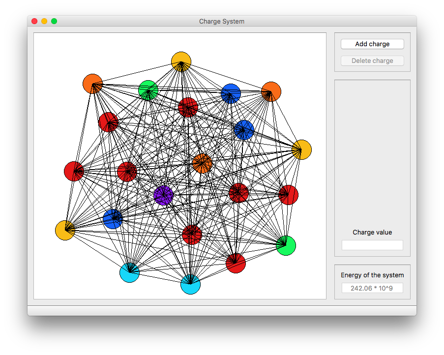

# Charge System

Программа, иллюстрирующая принцип взаимодействия системы электрических зарядов.

## Возможности

+ Заряды можно перетаскивать, что приведёт к изменению энергии взаимодействия системы
+ Заряды можно выделять (через ctrl), что позволяет удалять, перемещать или изменять значение сразу нескольким зарядам 
+ Цвет характеризует относительную величину заряда: красные - наиболее большие по модулю, фиолетовые - наиболее малые.

## Цвет - характеристика величины заряда 

Весь диапазон от 0 до величины самого большого заряда разбит на 7 равных интервалов, которым соответствуют 7 цветов - с
фиолетового по красный (цвета радуги).

Изменение величины заряда может повлиять на цвета остальных, если это затронуло величину максимального.

### Лицензия

Лицензия MIT.
